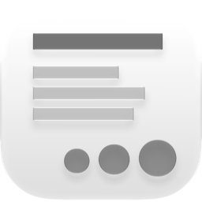
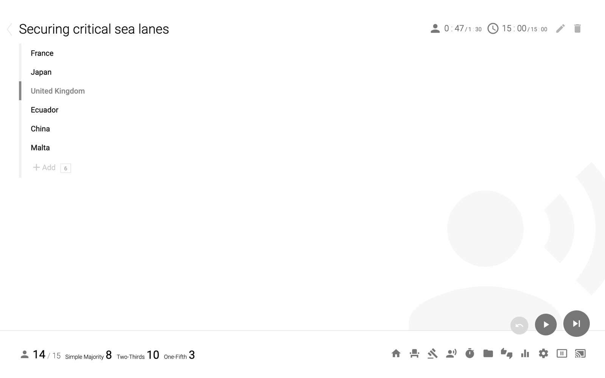
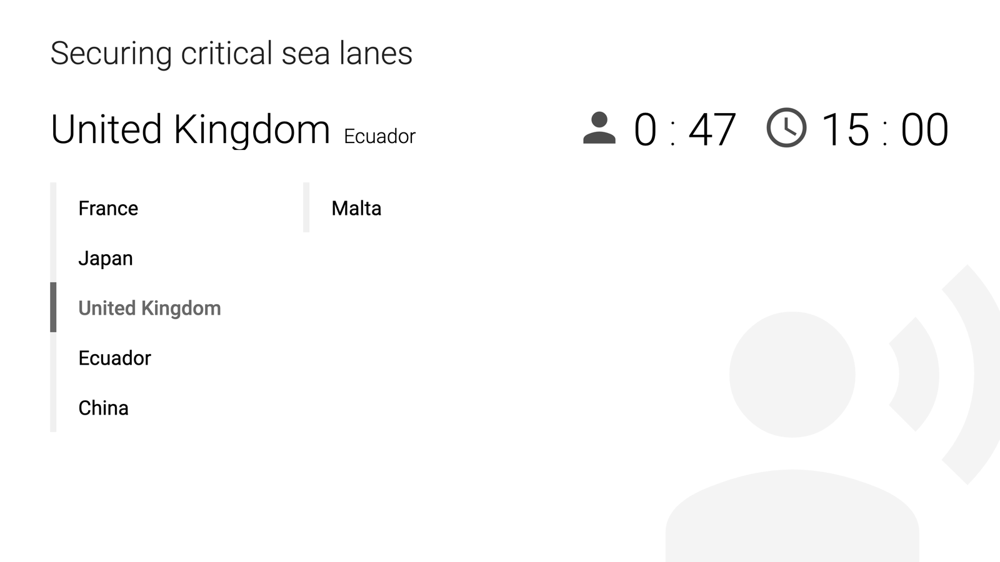
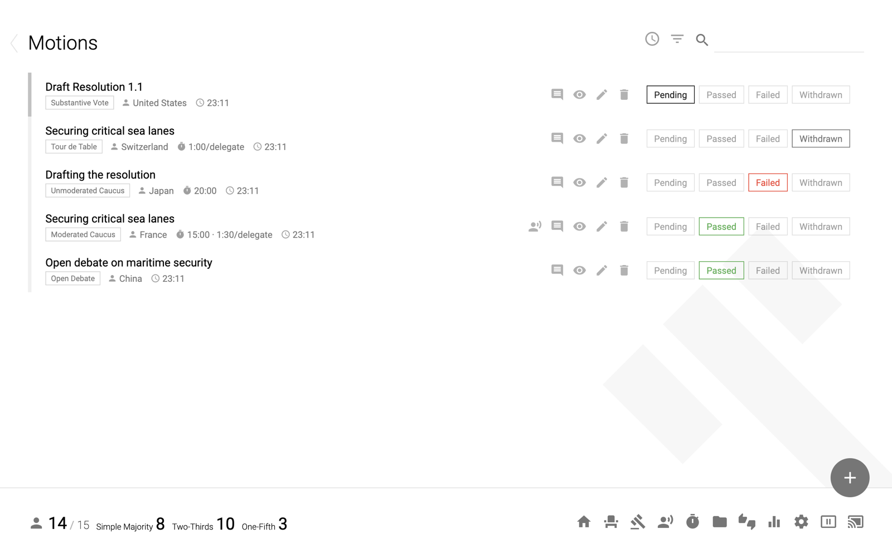
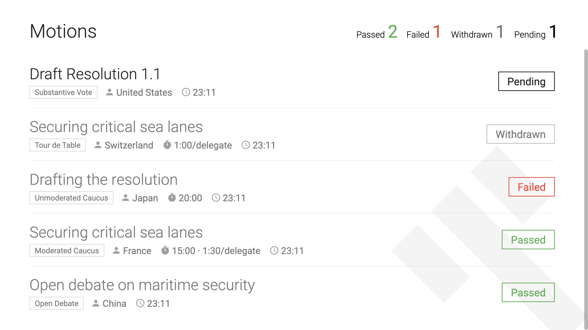
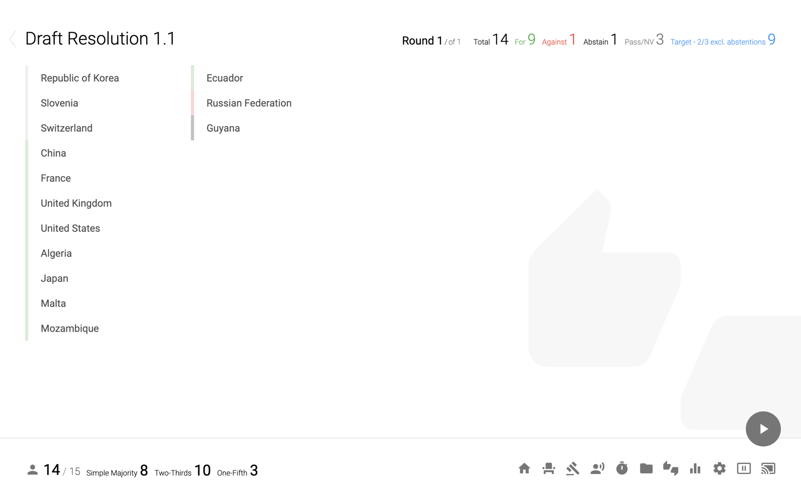
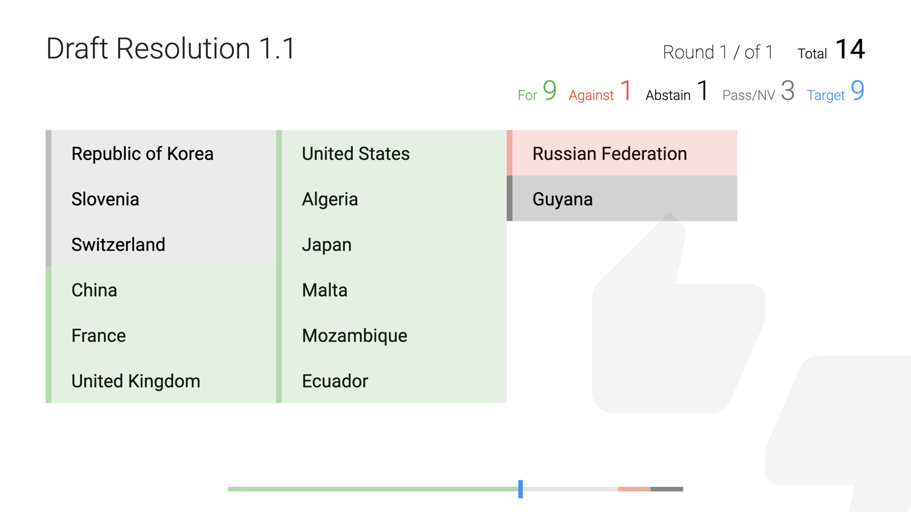
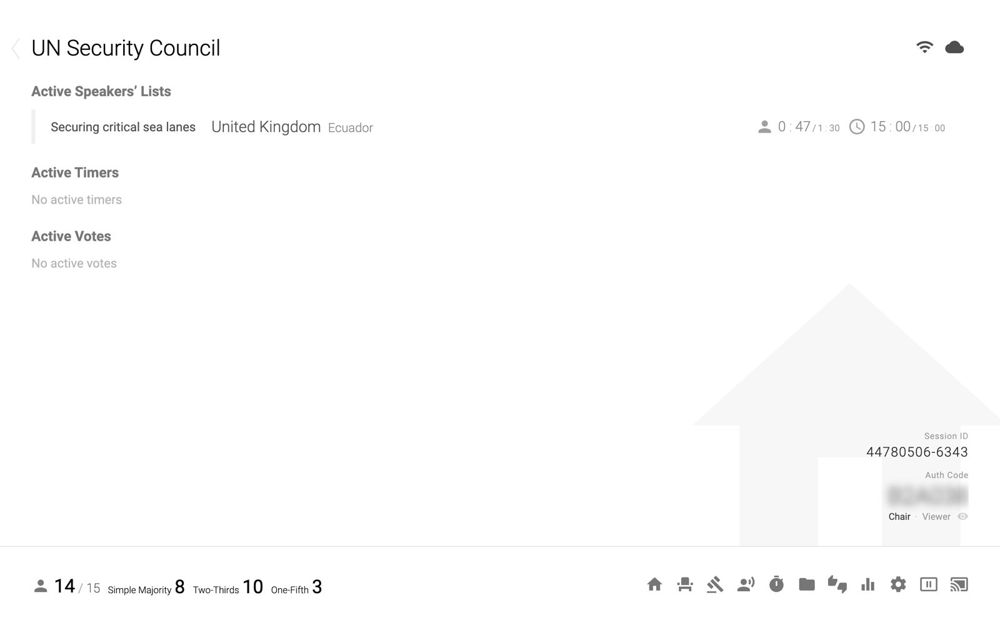

<p align="center">
  
</p>

<h1 align="center">Console Neo</h1>

<p align="center">
  The meeting console for Model UN.<br>
  模拟联合国会议控制台
</p>

<p align="center">
  
</p>

The chair works in the **controller** window. The **cast** window faces the room on a second
display. Co-chairs and viewers join the same session from their own devices, over the local
network or through a relay, and see every change live.

Console Neo is in beta (`2.0.0-beta.1`). It builds for macOS (universal, Apple silicon and
Intel) and Windows (x64).

## Features

**Speakers' lists.** Three controls: undo, start/pause, and next. Next has a 700 ms cooldown,
and Space only starts or pauses. The current speaker and both timers follow on the cast.

<p>
  
  
</p>

**Motions.** Record 14 motion types, sorted by time or disruptiveness. On a passed motion,
Execute & Go creates and opens its speakers' list, timer, or vote.

<p>
  
  
</p>

**Voting.** Record each delegation's vote across rounds, with a two-thirds target that excludes
abstentions. Each vote appears on the cast as it's entered.

<p>
  
  
</p>

**Collaboration.** Co-chairs and viewers join with the Session ID and a rotating Auth Code.
Devices on the same network connect directly; others connect through the relay. Committee data
stays on the host device.

<p>
  
</p>

Also included: roll call with live quorum thresholds, standalone timers, documents (PDF and
images) cast with synced zoom and scroll, per-delegate statistics, collaborative notes, and
Chinese and English interfaces.

## Getting started

1. On the launch page, choose **Create a Local Session...**
2. Choose **Create a New Committee** and name it. Select it under **Resume a Committee**, then
   choose **Start Chairing**.
3. In **Seats**, enter one delegation per line, then record attendance.
4. Click the rightmost cast icon in the bottom bar to open the cast. While it's closed,
   right-click the icon to open it windowed on the current screen.
5. To add co-chairs, share the Session ID and the Chair code from the committee home page.
   Viewers get the Viewer code.

The full user guides are on the website, in Chinese and English.

## Feedback

Beta and app feedback: [feedback@consoleneo.com](mailto:feedback@consoleneo.com).
Bugs and feature requests: [GitHub issues](https://github.com/Eric-ZhehanZ/Console-Neo/issues).

## Development

The app runs on Electron 22 (Chromium 108, Node 16).

```bash
npm install
npm run rebuildNative   # rebuild native modules for Electron
npm start               # full app
npm run server          # headless server only
npm test                # eslint
```

There is no build step: the renderers load HTML, CSS, and JS straight from disk. Reload a
window to pick up changes. See [CONTRIBUTING.md](CONTRIBUTING.md) before opening a pull request.

`npm run reset` deletes local committee data stored under `server/backend/storage/`. On macOS
the app stores data under its user-data directory instead.

### Packaging

```bash
npm run build      # macOS universal and Windows x64 → dist/
npm run buildMac   # macOS universal only
npm run buildWin   # Windows x64 only (no Wine needed)
npm run pack       # current platform and architecture
```

Builds are unsigned.

### Relay

`relay/` holds the relay as a Cloudflare Worker with one Durable Object per session.
`relay/local.js` is a dependency-free Node version for local testing:

```bash
RELAY_PORT=8787 node relay/local.js
```

### Website

`website/` is the product site and user guides (Next.js on vinext). Its feature sections embed
snapshots of the real app; see [website/README.md](website/README.md).

## License

Console Neo is free software, licensed under the
[GNU Affero General Public License v3.0 or later](LICENSE), with additional
terms under Section 7 covering attribution and trademarks (see
[NOTICE](NOTICE)).

In short: you can use, modify, and deploy Console Neo, including
commercially. If you distribute it or let others use a modified version
over a network, you must publish your source under the same license, keep
the copyright and attribution notices, and use your own name for your
version.

For deployment, customization, hosted service, or a license without these
conditions (including white-label use), contact [contact@consoleneo.com](mailto:contact@consoleneo.com).

Third-party software included in distributions is listed in
[THIRD_PARTY_NOTICES.md](THIRD_PARTY_NOTICES.md). Trademark use is covered in
[TRADEMARKS.md](TRADEMARKS.md).

### Lineage

Console Neo is an independently maintained revamp of
[Console Lite](https://github.com/CircuitCoder/Console-Lite) and
[Console Lite Edited](https://github.com/JieJiSS/Console-Lite-Edited). It
includes their MIT-licensed code, © 2016 Liu Xiaoyi and © 2018 Pan Ruizhe;
see [LICENSES/MIT.txt](LICENSES/MIT.txt). Those notices must be kept in any
distribution.

Console Neo isn't affiliated with or endorsed by the United Nations.
